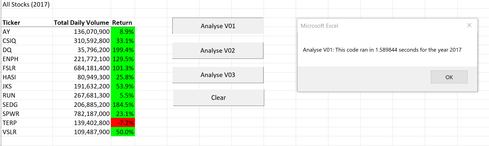
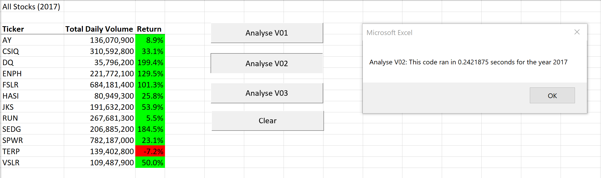
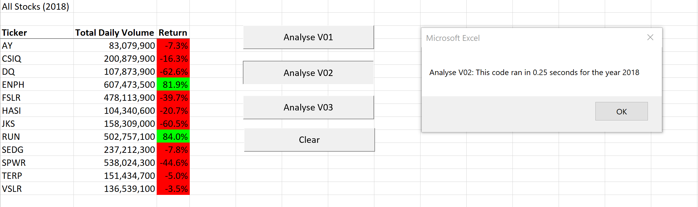
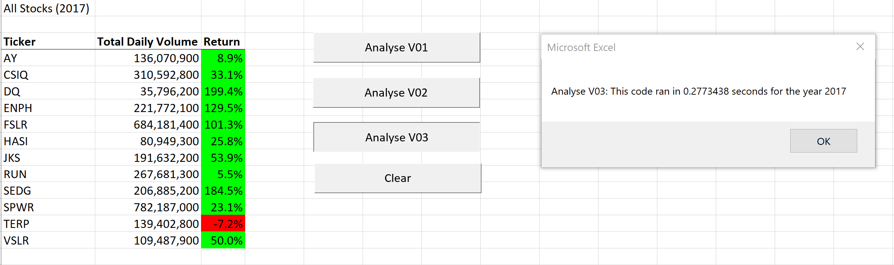
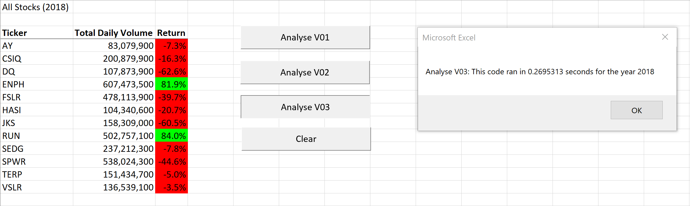

# stock-analysis

## Overview of Project

### Background

- A recent graduate is analyzing a set of green energy oriented companies stocks for his first clients and needs a basic tool to quickly analyze their historical performance.

### Purpose

- The objective of program is to deliver a tool that could deliver the total volume and stock growth for a selected year.

## Results

### Results and time obtained with original code

- Almost every stock had good performance in 2017 with exception of TERP.
- DQ, ENPH, FSLR and SEDG had positive triple digits returns.
- Almost every stock had negative performance in 2018 with the exception of ENPG and RUN.
- Only ENPG and RUN had positive performance in both years.
- Past performance is not necessarily a predictor of future performance, a more detailed analysis is recommended as the swings in performance observed in the sector indicates that there are high risks in this specific industry business environment.

- The original code run in 1.5898 seconds for 2017 and in 1.5195 for 2018.




### Original Code explanation

In the first version of the code a main code was (AllSotksAnalysis) used in combination with two subroutines (StockAnalysis and formatAllStocksAnalysisTable)

```VBA
'VBA Code
Sub AllStocksAnalysis()

    Dim yearValue As String
    
    Dim ticker As String

    Dim tickers(12) As String
    
    tickers(0) = "AY"
    tickers(1) = "CSIQ"
    tickers(2) = "DQ"
    tickers(3) = "ENPH"
    tickers(4) = "FSLR"
    tickers(5) = "HASI"
    tickers(6) = "JKS"
    tickers(7) = "RUN"
    tickers(8) = "SEDG"
    tickers(9) = "SPWR"
    tickers(10) = "TERP"
    tickers(11) = "VSLR"
    
    Dim startTime As Single
    Dim endTime As Single

    Worksheets("All Stocks Analysis").Activate
    
    yearValue = InputBox("What year would you like to run the analysis on?")
    
    startTime = Timer

    Range("A1").Value = "All Stocks (" & yearValue & ")"

    'Create a header row
    Cells(3, 1).Value = "Ticker"
    Cells(3, 2).Value = "Total Daily Volume"
    Cells(3, 3).Value = "Return"
    
    For i = 0 To 11

        ticker = tickers(i)

        'Do stuff with ticker
        Call StockAnalysis(ticker, i + 4, yearValue)
        Call formatAllStocksAnalysisTable

   Next i

    endTime = Timer
    MsgBox "Analyse V01: This code ran in " & (endTime - startTime) & " seconds for the year " & (yearValue)

End Sub
```

```VBA
Sub StockAnalysis(myTicker As String, myRow As Integer, myYear As String)

    Dim startingPrice As Double
    Dim endingPrice As Double


'Calculate Total Volume

    Worksheets(myYear).Activate

    rowStart = 2
    
    rowEnd = Cells(Rows.Count, "A").End(xlUp).Row
    'rowEnd code taken from https://stackoverflow.com/questions/18088729/row-count-where-data-exists
    'LastRow = Cells.Find("*", searchorder:=xlByRows, searchdirection:=xlPrevious).Row
    
    totalVolume = 0

    For i = rowStart To rowEnd
    
        'increase totalVolume if ticker is "DQ"
        If Cells(i, 1).Value = myTicker Then
            totalVolume = totalVolume + Cells(i, 8).Value
        End If
        
        'Starting Price
        If Cells(i - 1, 1).Value <> myTicker And Cells(i, 1).Value = myTicker Then
            startingPrice = Cells(i, 6).Value
        End If
        
        
        'Ending Price
        If Cells(i + 1, 1).Value <> myTicker And Cells(i, 1).Value = myTicker Then
            endingPrice = Cells(i, 6).Value
        End If
        
    Next i

    'MsgBox (totalVolume)
    

'Write Total Volume result

    Worksheets("All Stocks Analysis").Activate
    Cells(myRow, 1).Value = myTicker
    Cells(myRow, 2).Value = totalVolume
    Cells(myRow, 3).Value = (endingPrice / startingPrice) - 1
    
'Format
    If Cells(myRow, 3) > 0 Then
        'Color the cell green
        Cells(myRow, 3).Interior.Color = vbGreen
        
    ElseIf Cells(myRow, 3) < 0 Then
        'Color the cell red
        Cells(myRow, 3).Interior.Color = vbRed
    
    Else
        'Clear the cell color
        Cells(myRow, 3).Interior.Color = xlNone
    
    End If


End Sub
```

```VBA

Sub formatAllStocksAnalysisTable()

    'Formatting
    Worksheets("All Stocks Analysis").Activate
    
    With Range("A3:C3")
        .Font.Bold = True
        .Borders(xlEdgeBottom).LineStyle = xlContinuous
    End With
    
    Range("B4:B15").NumberFormat = "#,##0"
   Range("C4:C15").NumberFormat = "0.0%"
   
   Columns("B:C").AutoFit


End Sub
```

### Results and time obtained with second version (refactored code)

- As is observed in the following images the results obtained are the same
- time was reduced substantially.





### Second code explanation

- Only a main routine was used (AllStocksAnalysisRefactored)
- There are two relevant changes in this code:
    - The loop over all rows of the historical data only runs one time obtaining the results for all the tickets.
    - Output arrays are used to store the results of each stock on the fly.
- Running times are significantly reduced

```VBA
Sub AllStocksAnalysisRefactored()
    
    Dim startTime As Single
    Dim endTime  As Single
    
    'Variable used to store current ticket
    Dim currentTickerStr As String
    
    'Row Info
    
        'Last Row Ticker String
        Dim lastRowTickerStr As String
        'Current Row Ticker String
        Dim thisRowTickerStr As String
        'Next Row Ticker String
        Dim nextRowTickerStr As String
        'Current Row Volume
        Dim rowVolume As Long
    
   
    yearValue = InputBox("What year would you like to run the analysis on?")

    startTime = Timer
    
    'Format the output sheet on All Stocks Analysis worksheet
    Worksheets("All Stocks Analysis").Activate
    
    Range("A1").Value = "All Stocks (" + yearValue + ")"
    
    'Create a header row
    Cells(3, 1).Value = "Ticker"
    Cells(3, 2).Value = "Total Daily Volume"
    Cells(3, 3).Value = "Return"

    'Initialize array of all tickers
    Dim tickers(12) As String
    
    tickers(0) = "AY"
    tickers(1) = "CSIQ"
    tickers(2) = "DQ"
    tickers(3) = "ENPH"
    tickers(4) = "FSLR"
    tickers(5) = "HASI"
    tickers(6) = "JKS"
    tickers(7) = "RUN"
    tickers(8) = "SEDG"
    tickers(9) = "SPWR"
    tickers(10) = "TERP"
    tickers(11) = "VSLR"
    
    'Activate data worksheet
    Worksheets(yearValue).Activate
    
    'Get the number of rows to loop over
    RowCount = Cells(Rows.Count, "A").End(xlUp).Row
    
    '1a) Create a ticker Index
        Dim tickerIndex As Integer
        tickerIndex = 0

    '1b) Create three output arrays
        Dim tickerVolumes(11) As Long
        Dim tickerStartingPrices(11) As Single
        Dim tickerEndingPrices(11) As Single
    
    '2a) Create a for loop to initialize the tickerVolumes to zero.
        For tickerIndex = 0 To 11
            tickerVolumes(tickerIndex) = 0
        Next tickerIndex
        
        tickerIndex = 0
        currentTickerStr = tickers(tickerIndex)
        
    ''2b) Loop over all the rows in the spreadsheet.
    For i = 2 To RowCount
    
        'Get row info
        lastRowTickerStr = Worksheets(yearValue).Cells(i - 1, 1)
        thisRowTickerStr = Worksheets(yearValue).Cells(i, 1)
        nextRowTickerStr = Worksheets(yearValue).Cells(i + 1, 1)
        rowVolume = Worksheets(yearValue).Cells(i, 8)
        
        '3a) Increase volume for current ticker
        tickerVolumes(tickerIndex) = tickerVolumes(tickerIndex) + rowVolume
        
        '3b) Check if the current row is the first row with the selected tickerIndex.
        If thisRowTickerStr <> lastRowTickerStr Then
            
            'Get Start Price
            tickerStartingPrices(tickerIndex) = Worksheets(yearValue).Cells(i, 6)
            
        End If
        
        
        '3c) check if the current row is the last row with the selected ticker
        'If the next row’s ticker doesn’t match, increase the tickerIndex.
        If thisRowTickerStr <> nextRowTickerStr Then
            
            'Get Ending Price
            tickerEndingPrices(tickerIndex) = Worksheets(yearValue).Cells(i, 6)

            '3d Increase the tickerIndex.
            tickerIndex = tickerIndex + 1
            
            'Update Current Ticker Str
            currentTickerStr = tickers(tickerIndex)
            
            
        End If
    
    Next i
    
    '4) Loop through your arrays to output the Ticker, Total Daily Volume, and Return.
    
    For i = 0 To 11
        
        Worksheets("All Stocks Analysis").Activate
        Worksheets("All Stocks Analysis").Cells(4 + i, 1) = tickers(i)
        Worksheets("All Stocks Analysis").Cells(4 + i, 2) = tickerVolumes(i)
        Worksheets("All Stocks Analysis").Cells(4 + i, 3) = tickerEndingPrices(i) / tickerStartingPrices(i) - 1
        
    Next i
    
    
    'Formatting
    Worksheets("All Stocks Analysis").Activate
    
    'Column Titles Formating
    Range("A3:C3").Font.FontStyle = "Bold"
    Range("A3:C3").Borders(xlEdgeBottom).LineStyle = xlContinuous
    
    'Data formating
    Range("B4:B15").NumberFormat = "#,##0"
    Range("C4:C15").NumberFormat = "0.0%"
    Columns("B:C").AutoFit

    'Return formating (Color)
    dataRowStart = 4
    dataRowEnd = 15

    For i = dataRowStart To dataRowEnd
        
        If Cells(i, 3) > 0 Then
            
            Cells(i, 3).Interior.Color = vbGreen
            
        Else
        
            Cells(i, 3).Interior.Color = vbRed
            
        End If
        
    Next i
 
    'Register end time
    endTime = Timer
    MsgBox "Analyse V02: This code ran in " & (endTime - startTime) & " seconds for the year " & (yearValue)

End Sub

```

### Results and time obtained with third version (refactored code)

- The objective of this third code is introduce flexibility in the code, enabling the analysis of any number of stocks.
- Results are the same.
- Run times increased slightly.





### Third code explanation

- Stocks are not defined in the code.
- All arrays are redimensioned with the instruction ReDim Preserve to increase its length and preserve previous data as a new ticket is found in the data.

```VBA

Sub AllStocksAnalysisRefactored2()
    
'Variables Declaration---------------------------

    'Year value
    Dim yearValue As String

    'Timer Variables
    Dim startTime As Single
    Dim endTime  As Single
    
    'Ticker Index
    Dim tickerIndex As Integer
    
    'Tickers Count
    Dim tickersCount As Integer
    
    
    'Output arrays
    Dim tickers() As String
    Dim tickerVolumes() As Long
    Dim tickerStartingPrices() As Single
    Dim tickerEndingPrices() As Single
    
    'Variable used to store current ticket
    Dim currentTickerStr As String
    
    'Row Info
    
        'Last Row Ticker String
        Dim lastRowTickerStr As String
        'Current Row Ticker String
        Dim thisRowTickerStr As String
        'Next Row Ticker String
        Dim nextRowTickerStr As String
        'Current Row Volume
        Dim rowVolume As Long
        
        
'End of Variables Declaration---------------------


   'Get year from the user
    yearValue = InputBox("What year would you like to run the analysis on?")

    startTime = Timer
    
    'Format the output sheet on All Stocks Analysis worksheet
    Worksheets("All Stocks Analysis").Activate
    
    Range("A1").Value = "All Stocks (" + yearValue + ")"
    
    'Create a header row
    Cells(3, 1).Value = "Ticker"
    Cells(3, 2).Value = "Total Daily Volume"
    Cells(3, 3).Value = "Return"

    'Initialize array of all tickers
'    Dim tickers(12) As String
'
'    tickers(0) = "AY"
'    tickers(1) = "CSIQ"
'    tickers(2) = "DQ"
'    tickers(3) = "ENPH"
'    tickers(4) = "FSLR"
'    tickers(5) = "HASI"
'    tickers(6) = "JKS"
'    tickers(7) = "RUN"
'    tickers(8) = "SEDG"
'    tickers(9) = "SPWR"
'    tickers(10) = "TERP"
'    tickers(11) = "VSLR"
    
    'Activate data worksheet
    Worksheets(yearValue).Activate
    
    'Get the number of rows to loop over
    RowCount = Cells(Rows.Count, "A").End(xlUp).Row
    
    
    '2a) Create a for loop to initialize the tickerVolumes to zero.
'        For tickerIndex = 0 To 11
'            tickerVolumes(tickerIndex) = 0
'        Next tickerIndex
        
        tickersCount = 0
        tickerIndex = 0
        currentTickerStr = ""
        
    ''2b) Loop over all the rows in the spreadsheet.
    For i = 2 To RowCount
    
        'Get row info
        lastRowTickerStr = Worksheets(yearValue).Cells(i - 1, 1)
        thisRowTickerStr = Worksheets(yearValue).Cells(i, 1)
        nextRowTickerStr = Worksheets(yearValue).Cells(i + 1, 1)
        rowVolume = Worksheets(yearValue).Cells(i, 8)
        
        '3b) Check if the current row is the first row with the selected tickerIndex.
        If thisRowTickerStr <> lastRowTickerStr Then
        
            'Increase Tickers Count
            tickersCount = tickersCount + 1
            tickerIndex = tickersCount - 1
            'Redim arrays
            ReDim Preserve tickers(tickersCount)
            ReDim Preserve tickerVolumes(tickersCount)
            ReDim Preserve tickerStartingPrices(tickersCount)
            ReDim Preserve tickerEndingPrices(tickersCount)
            
            'Register Ticker Name
            tickers(tickerIndex) = thisRowTickerStr
            
            'Get Start Price
            tickerStartingPrices(tickerIndex) = Worksheets(yearValue).Cells(i, 6)
            
            'Set Volume and Endig price to zero
            tickerVolumes(tickerIndex) = 0
            tickerEndingPrices(tickerIndex) = 0
            
        End If
        
        '3a) Increase volume for current ticker
        tickerVolumes(tickerIndex) = tickerVolumes(tickerIndex) + rowVolume
        

        
        
        '3c) check if the current row is the last row with the selected ticker
        'If the next row’s ticker doesn’t match, increase the tickerIndex.
        If thisRowTickerStr <> nextRowTickerStr Then
            
            'Get Ending Price
            tickerEndingPrices(tickerIndex) = Worksheets(yearValue).Cells(i, 6)

            '3d Increase the tickerIndex.
            tickerIndex = tickerIndex + 1
            
            'Update Current Ticker Str
            currentTickerStr = tickers(tickerIndex)
            
            
        End If
    
    Next i
    
    '4) Loop through your arrays to output the Ticker, Total Daily Volume, and Return.
    
    For i = 0 To tickersCount - 1
        
        Worksheets("All Stocks Analysis").Activate
        Worksheets("All Stocks Analysis").Cells(4 + i, 1) = tickers(i)
        Worksheets("All Stocks Analysis").Cells(4 + i, 2) = tickerVolumes(i)
        Worksheets("All Stocks Analysis").Cells(4 + i, 3) = tickerEndingPrices(i) / tickerStartingPrices(i) - 1
        
    Next i
    
    
    'Formatting
    Worksheets("All Stocks Analysis").Activate
    
    dataRowStart = 4
    dataRowEnd = tickersCount + 4 - 1
    
    'Column Titles Formating
    Range("A3:C3").Font.FontStyle = "Bold"
    Range("A3:C3").Borders(xlEdgeBottom).LineStyle = xlContinuous
    
    'Data formating
    Range("B" & dataRowStart & ":B" & dataRowEnd).NumberFormat = "#,##0"
    Range("C" & dataRowStart & ":C" & dataRowEnd).NumberFormat = "0.0%"
    Columns("B:C").AutoFit

    'Return formating (Color)
    
    

    For i = dataRowStart To dataRowEnd
        
        If Cells(i, 3) > 0 Then
            
            Cells(i, 3).Interior.Color = vbGreen
            
        Else
        
            Cells(i, 3).Interior.Color = vbRed
            
        End If
        
    Next i
 
    'Register end time
    endTime = Timer
    MsgBox "Analyse V03: This code ran in " & (endTime - startTime) & " seconds for the year " & (yearValue)

End Sub

```

## Summary

- Code refactoring is a common practice for programmers and it allows to make each piece of code or function more specific and faster in order to reuse.
- The original code is easier to understand as each function has an specific purpose and result, but as there is a loop that runs for each ticker reading all registers or rows of the historic data is slower than the second and third version of the code.
- The third version of the code introduces flexibility to the code, now can be used to analyze any number of stocks, with only a slight impact on its overall performance.
- A fourth version could include the separation of the code in different pieces:
    - Loop of historical data
    - Writing results
    - Formating